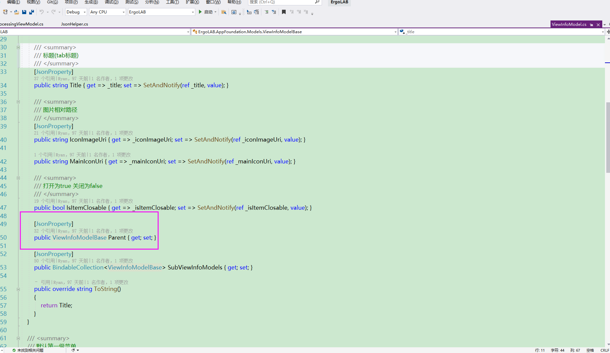

# System.Text.Json

## Example

```csharp
    public class JsonHelper
    {
        private static JsonSerializerOptions _options = new JsonSerializerOptions()
        {
            ReferenceHandler = ReferenceHandler.Preserve,
            WriteIndented = true,
            IncludeFields = true,
            IgnoreReadOnlyProperties = true,
            DefaultIgnoreCondition = JsonIgnoreCondition.WhenWritingNull,
            DictionaryKeyPolicy = JsonNamingPolicy.CamelCase,
            PropertyNamingPolicy = JsonNamingPolicy.CamelCase,
            PropertyNameCaseInsensitive = true, //不区分大小写
        };

        static JsonHelper()
        {
            _options.Converters.Add(new JsonStringEnumConverter());
        }

        public static string GetJosnString<T>(T t)
        {
            return JsonSerializer.Serialize(t, _options);
        }

        public static T GetJosnObject<T>(string jsonString)
        {
            return JsonSerializer.Deserialize<T>(jsonString, _options);
        }
    }

    public class TestModel
    {
        [JsonIgnore]
        public int Id { get; set; }

        [JsonInclude]
        public string Name { get; set; }

        [JsonPropertyName("type")]
        public Type Type { get; set; }
    }

```

### 支持

- 添加$id $Values ReferenceHandler = ReferenceHandler.Preserve
- 枚举序列化为 number（默认方式），也可序列化为字符串 JsonStringEnumConverter
- 自定义输出（不输出）字段 [JsonInclude] [JsonIgnore]
- 自定义输出名字 [JsonPropertyName("type")]
- 属性名小写（web 相关 msg）PropertyNamingPolicy = JsonNamingPolicy.CamelCase

### 不支持

- 不支持$type 的序列化，导致未指定的类型，比如 object 或者基类 序列化后再反序列化的时候恢复不了原来的类型
  

## 参考资料

https://docs.microsoft.com/zh-cn/dotnet/standard/serialization/system-text-json-overview
https://www.codeproject.com/Articles/5284591/Adding-type-to-System-Text-Json-serialization-like
