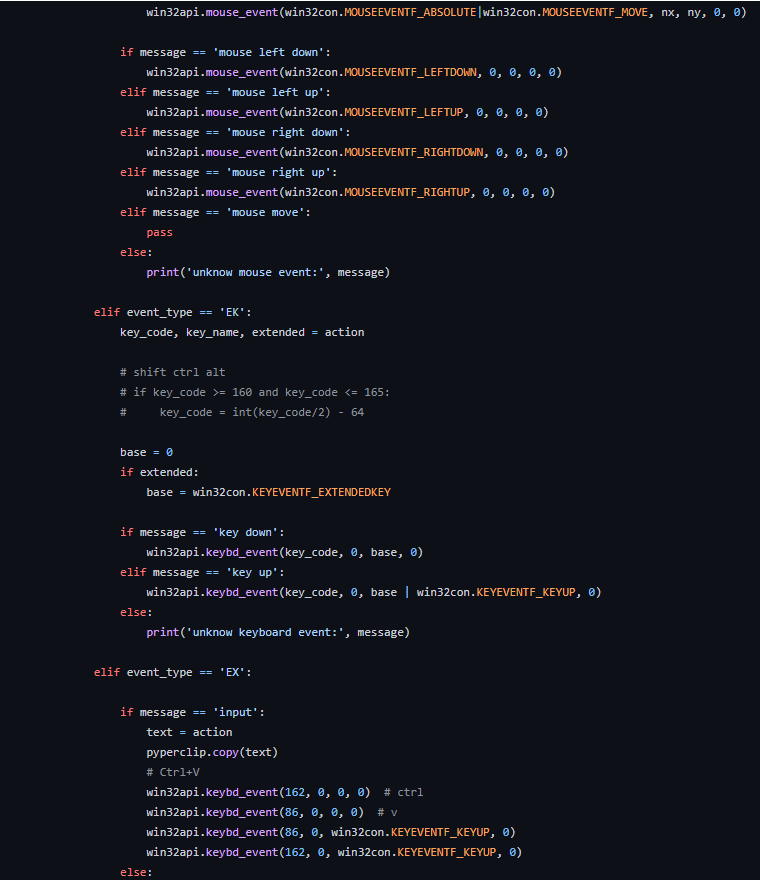
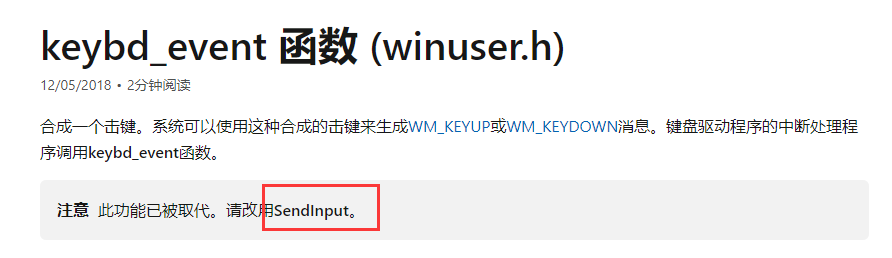

代码模拟鼠标、键盘进行操作

https://github.com/taojy123/KeymouseGo
https://github.com/michaelnoonan/inputsimulator
https://docs.microsoft.com/en-us/windows/win32/api/winuser/nf-winuser-keybd_event

使用win32API mouse_event keybd_event  SetCursorPos 已实现，用SendInput代替模拟一下，没有相应效果
