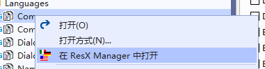
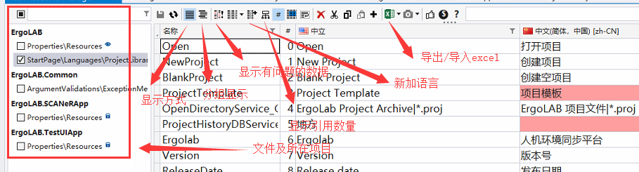
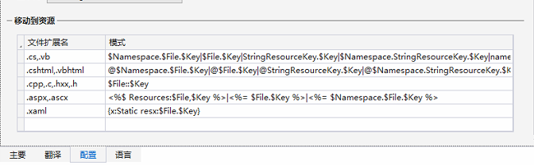

# 中英文切换

##  ResxManager工具说明
1. 用于在两个甚至更多资源文件中添加、删除、对比、检查
2. 安装方式: Visual Studio的扩展中搜索ResxManager
3. 打开方式: 右键resx文件->在ResxManager中打开
   
4. 界面介绍
   
5. 配置: 主要编辑 .cs 和 .xmal 扩展名的模式
   
   
##  引用方式
1. 在每个模块中新建文件夹Languages并创建相应的 .resx文件和 .zh-Hans.resx 其他语言同理，也可在resxManager中添加
2. 使用resxManager打开 .resx文件，并添加项(可导出excel填写完成后再导入)
3. 在resxManager中右键 .resx文件，修改作用域为公共访问
4. xaml引用: 在文件顶部引入命名空间，之后把需要中英文切换的文字替换

```
//xaml 引用
xmlns:resx="clr-namespace:ErgoLAB.Design.Languages"
//Text="{x:Static resx:AOI.WebpageAOISettings}"  resx的使用
  <TextBlock Margin="8 0 0 0" Style="{StaticResource GroupBoxTitleStyle}"
      Text="{x:Static resx:AOI.WebpageAOISettings}" Visibility="{c:Binding IsWebpageStimuli,FalseToVisibility=Collapsed}"/>
```

5. 在xaml页中如果有需要中英文替换的字段，可以选中该字段，右键移动到资源，弹出ResxManager界面，之后再ResxManager中填写中文字段即可，如果弹不出这个界面重启Vs可解决
6. cs文件引用：using ErgoLAB.StartPage.Languages;之后使用Common.Version获取名称

##  命名及规范
1. 全局多出用到的文本统一写在AppFoundation.Languages下的相应文件中
  Common->通用词汇翻译，Segment，Event，SegmentType, etc.
  Window->主窗体，Tab，BackgroundTask，Upgrade，Setting，etc.
  Dialog->弹框的按钮,OK、Cancel、Save、Export、Yes、No etc.
  Overview->总览界面通用，Name，CreateDate，Subject，DefaultSetting，etc.
  NamePrefix->名称前缀，BehaviorGroup，Group，Instruction，Timeline，etc.
2.  每个功能模块下新建Common.resx用于添加该模块下比较通用的词汇，其他单独界面或模块可单独新建分文件[模块名].resx
3. 部分特殊词汇不用翻译，例：ErgoLAB、EMG、EDA、HRV、RESP、EEG...
4. 字段名称首字母大写，可以清楚的理解字段意义，对于段落类文本的命名不要全文本翻译
5. xaml引入文件命名；本模块下默认命名为resx，引用AppFoundation下的文件命名为appResx

##  其他
1. 在.cs文件中常量需要引用字段时 将常量改为只读
2. MessageBox消息内容命名：...Msg,例如CreateInstractionFailedMsg
3. Enum的处理，Description里的内容对应ResxManager的key，枚举的中英文放在 ErgoLAB.Common.Languages.Enum中
    
```csharp
//Description对应ResxManager的key
public enum ParamViewModelType
{
    [Description("Behavior")]
    Behavior,

    [Description("Eyetracking")]
    Eyetracking,

    [Description("Biometrics")]
    Biometrics
}

//枚举描述的使用
Title = $"{ErgoLAB.Statistics.Languages.Common.TitleSelect}{ParamViewModelType.GetDescription()}{ErgoLAB.Statistics.Languages.Common.TitleConditionParameter}";
```
4. 验证提示或ToolTip内容命名：...Tip
5. 切换项目分支会导致移动到资源失败，重启VS即可
6. 差值处理
```xml
<TextBlock  Style="{StaticResource TextBlockCenterDescriptionStyle}">
    <Run Text="{x:Static resx:ProcessAnalyze.SegmentsLimitPart1}"/>
    <Run Text="{Binding CurrentBioParam.MinValidDuration.TotalSeconds,Mode=OneTime}"/>
    <Run Text="{x:Static resx:ProcessAnalyze.SegmentLimitPart2}"/>
</TextBlock>
```
7. 标点符号处理
8. 字体处理
    雅黑字体FontWeight没有Medium的效果
    Theme.TextBlock.xaml（Application.Current.Resources.MergedDictionaries）
    可以采用Dark Mode类似的方法，动态替换TextBlock的Style，如果是中文Medium改为Bold
9. 导入导出文件汉化处理(优先度低)

##  参考
1. https://www.cnblogs.com/wpinfo/p/wpf_localization.html
1. https://www.cnblogs.com/dino623/p/LocalizationWPF.html
1. https://yq.aliyun.com/articles/544377