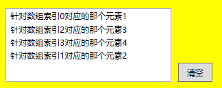
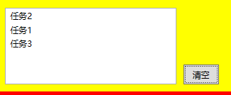

Parallel:以**异步方式遍历**内部语句块，Parallel 调用之间为同步关系，**使用 Parallel 循环时方法并行但顺序不固定**。

## 常用方法

1. Parallel.for
   for 方法，主要用于处理针对数组元素的并行操作

   ```
   private void PatallelFor()
           {
               int[] numberArray = new int[] { 1, 2, 3, 4 };
               Parallel.For(0, numberArray.Length, (i) =>
               {
                   //后台线程直接修改页面控件属性会报错，已经有线程占用，要异步修改
                   UserInfoListBox.Dispatcher.BeginInvoke((Action)delegate ()
                   {
                       UserInfoListBox.Items.Add($"针对数组索引{i}对应的那个元素{numberArray[i]}");
                   });
               });
           }
   ```

   结果：
   
   输出结果，并不是按照数组顺序的，所以如果我们的输出必须是同步的或者必须是顺序的，则不应使用 Parallel 方式。

2. Parallel.forEach
   forEach 的独到之处就是可以将数据进行分区，每一个小区内实现串行计算。

   ```
    private void PatallelForeach()
           {
               int[] numberArray = new int[] { 1, 2, 3, 4 };
               Parallel.ForEach(numberArray, num =>
               {
                   //后台线程直接修改页面控件属性会报错，已经有线程占用，要异步修改
                   UserInfoListBox.Dispatcher.BeginInvoke((Action)delegate ()
                   {
                       UserInfoListBox.Items.Add($"当前集合元素{num}");
                   });
               });
           }
   ```

   结果：
   
   Foreach 执行效果同 For 一样，并行顺序不固定，所以想要输出结果为同步或顺序的话，不应使用 Parallel 方式。

3. Parallel.Invoke

```
private void PatalledInvoke()
        {
            Parallel.Invoke(
                () =>
                {
                    UserInfoListBox.Dispatcher.BeginInvoke((Action)delegate ()
                    {
                        UserInfoListBox.Items.Add("任务1");
                    });
                },
                () =>
                {
                    UserInfoListBox.Dispatcher.BeginInvoke((Action)delegate ()
                    {
                        UserInfoListBox.Items.Add("任务2");
                    });
                },
                () =>
                {
                    UserInfoListBox.Dispatcher.BeginInvoke((Action)delegate ()
                    {
                        UserInfoListBox.Items.Add("任务3");
                    });
                });
        }
```

结果：

同样，由于所有的任务都是并发的，所以它不包含保证先后次序。
