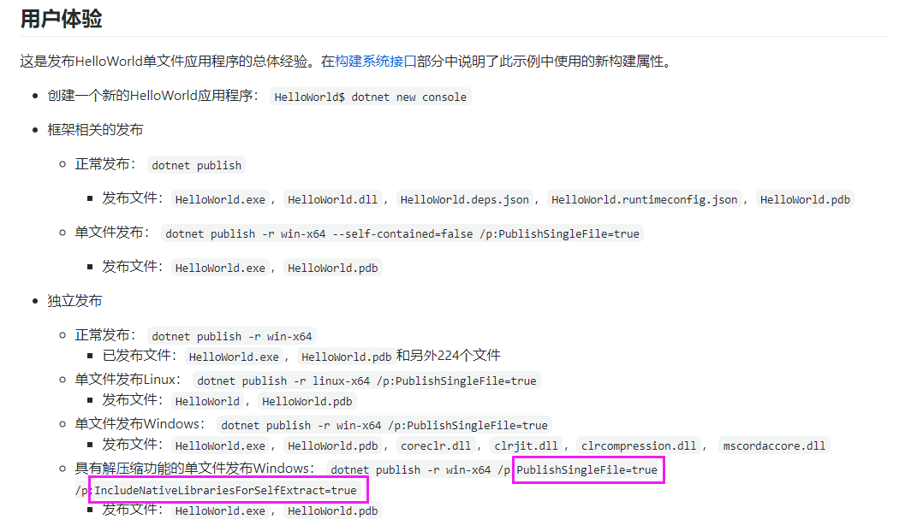

#VS2019 基于.net 5 单文件打包

.NET5环境 下载
https://dotnet.microsoft.com/zh-cn/download/visual-studio-sdks?utm_source=getdotnetsdk&utm_medium=referral
This release is only compatible with Visual Studio 2019 (v16.8).

.NET5单文件发布
https://github.com/dotnet/designs/blob/main/accepted/2020/single-file/design.md

对比 .net core 3.1单文件发布 .net 5发布单文件需要将IncludeNativeLibrariesForSelfExtract设置为True，否则发布的文件会多4个文件（coreclr.dll，clrjit.dll，clrcompression.dll， mscordaccore.dll）
