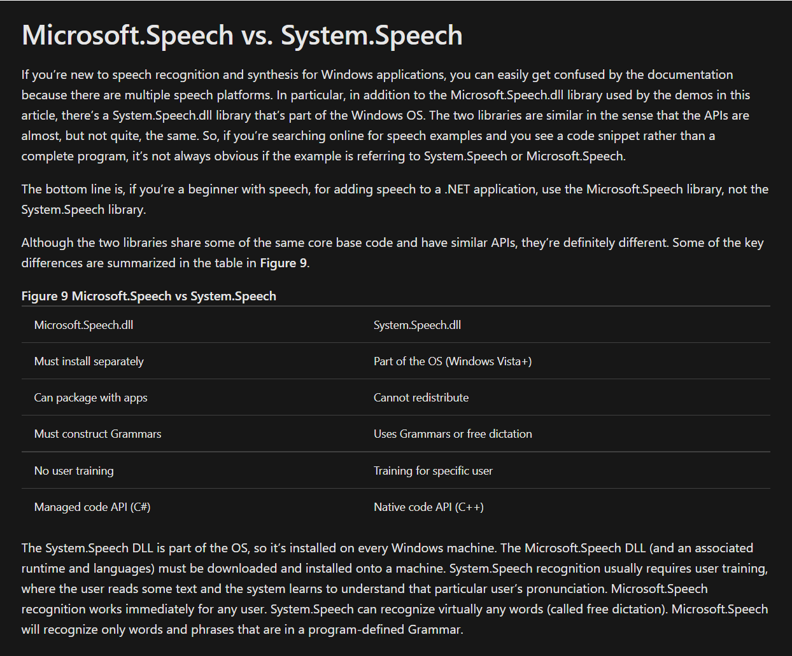

https://docs.microsoft.com/en-us/previous-versions/office/developer/speech-technologies/dd147134(v=office.14)
https://docs.microsoft.com/en-us/dotnet/api/system.speech.recognition.speechrecognizer?view=netframework-4.8
https://docs.microsoft.com/en-us/archive/msdn-magazine/2014/december/voice-recognition-speech-recognition-with-net-desktop-applications

识别词 | System Speech | Micosoft Speech |实际个数
:----------- | :-----------: | -----------:
开始        |     56 |       22|       4
训练        |     90|       33|       4
注意力        |     25    |       5|       10

System.Speech 识别速度快，Microsoft.Speech 准确率高（方言也可以识别）

现有方案：
1、判断是否安装Microsoft语音识别必要程序，已安装用Microsoft，未安装用System
2、提供Microsoft语音识别必要程序下载链接