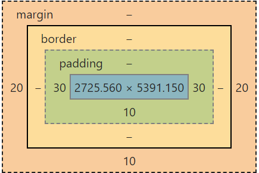

# WPF UI Layout

## 简介

### 什么是 WPF？

Windows Presentation Foundation (WPF) 是一个可创建桌面客户端应用程序的 UI 框架。 WPF 开发平台支持广泛的应用开发功能，包括应用模型、资源、控件、图形、布局、数据绑定、文档和安全性。 此框架是 .NET Framework 的一部分，因此，如果你曾经使用 ASP.NET 或 Windows 窗体通过 .NET 构建应用程序，应该会熟悉此编程体验。 WPF 使用 Extensible Application Markup Language (XAML)，为应用编程提供声明性模型。

### 什么是布局？

简单来说，布局就是把一些控件有条理的摆放在界面上合适的位置，显然摆的乱七八糟不能算布局。
可以比喻为房间的装修，将各种家具有条理的摆放到心仪的位置，而不是随处乱放。

### 常用控件

- Button 按钮，常用属性：Width、Height、Content 事件：Click 点击按钮触发事件执行内部语法
- TextBlock 是只读的文本框，无法进行编辑，比较适合显示文本，该文本内容不允许编辑的情况。Text 属性显示文本内容，还可以设置字体大小，颜色等属性
- TextBox 是支持编辑的基本控件，我们平时不管是开发 BS 或者是 CS 的桌面应用，该控件的使用，应该都不陌生。
- ComboBox 下拉选择框，需要绑定或直接编写内部子集，常用属性：ComboBoxItem,SelectedIndex,SelectedItem 等，事件：SelectionChanged 选中项改变触发事件执行内部语法
- Border 边框控件 有两个主要属性：BorderThickness 边框宽度，BorderBrush 画刷颜色,CornerRadius 获取或设置一个值，该值表示将 Border 的角倒圆的程度

### 常用属性

- Margin：是约束控件与父容器控件的边距，依次为：左、上、右、下
- Padding：是约束控件内部输入边距的，只有部分控件有此属性
- Width：控件内容宽度
- Height：控件内容高度
- Background：内容背景色
- Fill：填充色，一般用于形状控件,如：Rectangle，Ellipse，Polygon 等。



### 规范

- 命名：元素名称要有一个显示类型身份，如：MainGrid,OKButton,NameTextBox 等。
- Margin Padding 属性数值之间使用空格分割

### 示例代码

- XAML

```xml
       <Grid Background="Green">
           <Grid Margin="10">
               <Border BorderThickness="10 20 30 20" BorderBrush="Red">
                   <Grid Background="Yellow">
                       <Grid.RowDefinitions>
                           <RowDefinition Height="50"/>
                           <RowDefinition Height="Auto"/>
                           <RowDefinition Height="*"/>
                           <RowDefinition Height="*"/>
                           <RowDefinition Height="*"/>
                           <RowDefinition Height="*"/>
                       </Grid.RowDefinitions>
                       <Grid.ColumnDefinitions>
                           <ColumnDefinition/>
                           <ColumnDefinition/>
                           <ColumnDefinition/>
                       </Grid.ColumnDefinitions>
                       <TextBlock Text="用户信息" Height="30" VerticalAlignment="Center" FontSize="18" FontWeight="Bold" Foreground="Blue" TextAlignment="Right"/>
                       <TextBlock Text="姓名：" Grid.Row="1" Height="30" VerticalAlignment="Center" FontSize="16" Foreground="Blue" TextAlignment="Right"/>
                       <TextBox x:Name="NameTxt" Text="请输入姓名" Grid.Row="1" Grid.Column="1" Margin="24"/>
                       <TextBlock Text="性别：" Grid.Row="2" Height="30" VerticalAlignment="Center" FontSize="16" Foreground="Blue" TextAlignment="Right"/>
                       <ComboBox x:Name="GenderComboBox" Grid.Row="2" Grid.Column="1" Height="28" Width="100" HorizontalAlignment="Left" Margin="24 0" SelectedIndex="0" SelectionChanged="GenderComboBox_SelectionChanged">
                           <ComboBoxItem Content="男"/>
                           <ComboBoxItem Content="女"/>
                       </ComboBox>

                       <Button Grid.Row="3" Grid.Column="1" x:Name="SaveButton" Width="80" Height="30" Content="保存" HorizontalAlignment="Right" Click="SaveButton_Click" />

                       <TextBlock Text="用户列表：" Grid.Row="4" Height="30" VerticalAlignment="Top" FontSize="16" Foreground="Blue" TextAlignment="Right"/>
                       <ListBox x:Name="UserInfoListBox" Grid.Row="4" Grid.Column="1" Grid.RowSpan="2" Margin="0 0 0 10"/>
                       <Button x:Name="ClearButton" Content="清空" Grid.Row="5" Grid.Column="2" Height="28" Width="50" HorizontalAlignment="Left" VerticalAlignment="Bottom" Margin="10" Click="ClearButton_Click"/>
                   </Grid>
               </Border>
           </Grid>
       </Grid>
```

- cShape

```csharp
 public partial class MainWindow : Window
    {
        private string _genderStr = "男";
        public MainWindow()
        {
            InitializeComponent();
        }

        private void GenderComboBox_SelectionChanged(object sender, SelectionChangedEventArgs e)
        {
            var comboBoxItem = this.GenderComboBox.SelectedItem as ComboBoxItem;
            _genderStr = comboBoxItem.Content.ToString();
        }

        private void SaveButton_Click(object sender, RoutedEventArgs e)
        {
            if (this.NameTxt.Text.Length > 0)
            {
                UserInfoListBox.Items.Add($"姓名：{this.NameTxt.Text}，性别：{_genderStr}");
            }
        }

        private void ClearButton_Click(object sender, RoutedEventArgs e)
        {
            UserInfoListBox.Items.Clear();
        }
    }

```

## 布局控件

### Grid 网格

可以定义任何数量的行和列，还可以设置自己纵向跨几行，横向跨几列。此面板使子元素按照纵横网格排列。默认情况下，在容器中最后定义的内容元素覆盖前面的内容元素，如果设置了 Panel.ZIndex 属性按照 ZIndex 属性来重叠布局。

```xml
 <Grid>
         <Grid.RowDefinitions>
             <RowDefinition />
             <RowDefinition />
         </Grid.RowDefinitions>
         <Grid.ColumnDefinitions>
             <ColumnDefinition/>
             <ColumnDefinition />
         </Grid.ColumnDefinitions>
         <Rectangle Fill="Aqua" Height="200" Width="200" VerticalAlignment="Center" />
         <Rectangle Fill="Chocolate" Height="200" Width="200" Grid.Row="1" />
         <Rectangle Fill="Aquamarine" Height="200" Width="200" Grid.Column="1" />
         <Rectangle Fill="BlanchedAlmond" Height="200" Width="200" Grid.Column="1" Grid.Row="1" />
     </Grid>
```

::: tip 适用场景
UI 布局的大框架设计
大量 UI 元素需要成行或成列对齐的情况
UI 尺寸改变的时候，元素需要保留固有的宽度和高度比例
:::

### UniformGrid

各个单元格的大小完全相同，宽与高分别相同；
默认情况下，单元格的数量取决于放入的控件的数量，且单元格一定是行、列数相同，即 1X1、2X2 、3X3 等等的单元格分布；
★（重要、常用） UniformGrid 有两个属性，分别是：Columns 和 Rows ，它们是分别用来指定当前的最大列数和最大的行数，如果只设置了其中一个而不设置另外一个的话，那么没有设置的那个默认为 1；在设置的这两个属性的情况下，UniformGrid 不再会按照行、列数相同来分布，而是按照用户指定的 Columns 和 Rows 来分布；

```xml
<UniformGrid Columns="2" Rows="3">
    <Rectangle Fill="Aqua"/>
    <Rectangle Fill="Red"/>
    <Rectangle Fill="Red"/>
    <Rectangle Fill="Aqua"/>
    <Rectangle Fill="Aqua"/>
    <Rectangle Fill="Red"/>
</UniformGrid>
```

### StackPanel 栈式面板

此面板使子元素按照水平或垂直方向排列，两个方向只能选其一。当移除一个元素后，后面的元素会自动向前填充空缺。ToolBarPanel 类派生自 StackPanel。

```xml
  <StackPanel Orientation="Horizontal">
         <Rectangle Fill="Aqua" Height="200" Width="200"/>
         <Rectangle Fill="Red" Height="200" Width="200"/>
         <Rectangle Fill="BlanchedAlmond" Height="200" Width="200"/>
     </StackPanel>
```

::: tip 适用场景

同类元素需要紧凑排列（如制作菜单和列表）；移除其中的元素后能够自动补缺的布局或动画
:::

### Canvas 画布

此面板可承载任意元素，包括控件，图形，甚至文字。各种元素依据屏幕坐标确定位置。
Canvas 是一个允许显式指定控件位置的面板。它定义了相关的 Left、Right、Top 和 Bottom 属性，这些属性可以由子元素在面板中定位时使用，内部元素可以使用以像素为单位的绝对坐标进行定位，类似于 Windows Form 的布局方式。

```xml
 <Canvas>
        <TextBlock Text="用户名：" Canvas.Left="12" Canvas.Top="12"/>
        <TextBox Width="200" Canvas.Left="66" Height="23" Canvas.Top="9" BorderBrush="Black"/>
        <TextBlock Text="密码：" Canvas.Left="12" Canvas.Top="40.72" Height="16" Width="36"/>
        <TextBox Width="200" Canvas.Left="66" Height="23" Canvas.Top="38" BorderBrush="Black"/>
        <Button Content="确定" Width="80" Height="22" Canvas.Left="100" Canvas.Top="67"/>
        <Button Content="清除" Width="80" Height="22" Canvas.Left="186" Canvas.Top="67"/>
    </Canvas>
```

### DockPanel 泊靠式面板

此面板可指定元素的排列停靠方式，每个子元素的排列方式可以不同，最后一个元素默认情况充满剩下容器空间，即 lastChildFill 属性默认为 true，如果不想最后一个元素填满剩余区域，可以将 lastChidFill 属性设置为 false 并且需要设置最后一个元素停靠方向。
DockPanel 可以指定排列子控件的区域。DockPanel 定义了相关的 Dock 属性，可以在控件的子控件中将它设置为 Left、Right、Top 和 Bottom。

```xml
 <DockPanel Name="dockPanel1">
         <Button DockPanel.Dock="Top" VerticalAlignment="Top" Height="30"/>
         <Rectangle Fill="PaleVioletRed" Width="160" DockPanel.Dock="Left" />
         <Button Height="20" DockPanel.Dock="Bottom" />
         <Rectangle Fill="SaddleBrown" Width="100" DockPanel.Dock="Right" />
         <Rectangle Fill="Yellow"/>
     </DockPanel>
```

::: tip 适用场景
填充整个剩余空间
:::

### WrapPanel 自动折行面板

使子元素按照水平或垂直方向排列，在行或列处换行或列，依旧按照水平或垂直方向从左到右或从上到下排列。

```xml
<WrapPanel Orientation="Horizontal">
      <Button Width="100">按钮1</Button>
      <Button Width="100">按钮2</Button>
      <Button Width="100">按钮3</Button>
      <Button Width="100">按钮4</Button>
      <Button Width="100">按钮5</Button>
      <Button Width="100">按钮6</Button>
</WrapPanel>
```

Orientation 属性的值设置为 Vertical，按钮将纵向连续排列
注意 WrapPanel 的两个属性：
ItemHeight——所有子元素都一致的高度，任何比 ItemHeight 高的元素都将被截断。
ItemWidth——所有子元素都一致的宽度，任何比 ItemWidth 高的元素都将被截断。

## 布局属性

| _属性_                                                | _含义_                                                                                                                                   |
| ----------------------------------------------------- | ---------------------------------------------------------------------------------------------------------------------------------------- |
| HorizontalAlignment                                   | 用于设置子元素在容器中的水平位置。 参数: Center、Left、Right、Stretch                                                                    |
| VerticalAlignment                                     | 用于设置子元素在容器中的垂直位置。 参数: Center、Top、Bottom、Stretch                                                                    |
| Margin                                                | 用于指定元素与其父级或同级之间的距离。 参数: 4 个方向的边距(左、上、右、下) 使用： 可以同时设置 4 个相同边距、也可以单独设置每条边的边距 |
| Padding                                               | 用于指定元素与其子级之间的距离。 参数: 4 个方向的边距(左、上、右、下) 使用： 可以同时设置 4 个相同边距、也可以单独设置每条边的边距       |
| Height/Width，MinHeight/MinWidth，MaxHeight/ MaxWidth | 设置元素的基本尺寸、有固定尺寸、最小尺寸、最大尺寸                                                                                       |
