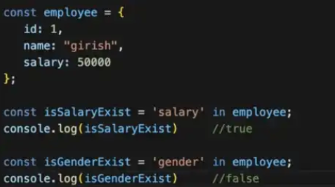
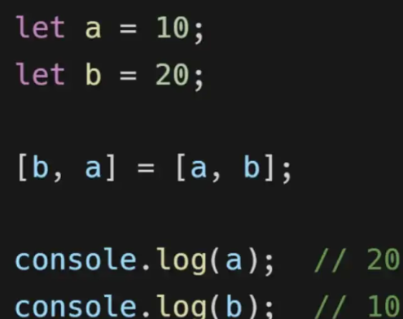
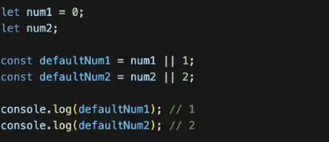

## 10 个 Javascript 技巧和最佳实践

JavaScript 是最常用的编程语言之一，同时有数据显示，它世界上十大最受欢迎的编码语言之一。
当然，在前端领域里，JavaScript 是我们日常生活中不可或缺的一部分，它与 HTML 和 CSS 被为前端开发里的新三剑客，我们访问的任何网站都有它们的身影，当然，它们都各种有自己的特定的用途。
所以说，JavaScript 无处不在，学习 JavaScript 也是每前端人必须要过的一关。
JavaScript 功能强大且灵活，它允许我们以任何我们喜欢的方式编写代码，并尝试一些非常不寻常的事情，这些事情可能会导致代码中的错误。
今天，我就想跟你分享一些，我在学习 JavaScript 编码的一些好用的技巧，希望对你用。

## 1、使用正确的变量名

使用特定的命名约定，主要使用驼峰命名约定。
变量名称应简洁且具有描述性。
## 2、小心使用松散相等运算符进行比较

如果需要，松散相等运算符 (== OR !=) 在比较之前执行自动类型转换。
就像上面的例子一样，你可以使用松散等式运算符得到意想不到的输出。

## 3、检查属性是否存在于对象中

in 运算符返回布尔值 true/false。
如果对象或其原型链中存在属性，则 in 运算符返回 true。

## 使用加号 (+) 运算符将字符串转为数字

一元加号运算符 (+) 是将某些内容转换为数字的最快和首选方法。

## 5、使用 slice 和 padStart 掩码数字

slice() 方法将数组中的选定元素作为新数组返回，负数从数组的末尾选择。

padStart() 方法用另一个字符串填充当前字符串，直到结果字符串达到给定长度。从当前字符串的开头应用填充。
可以用更少的代码进行屏蔽。

## 6、使用console.log改进变量日志

在 JavaScript 中，我们使用 console.log() 来记录变量或消息。当变量日志太多时，有时很难理解控制台中的日志对应的变量是什么。
要记录变量，请将变量包装到一对大括号 {variable-name} 中，提高可读性。

## 7、交换两个变量的简单方法

使用解构赋值方法，因为它简短且富有表现力，仅在一行语句中执行。它适用于任何数据类型，如数字、字符串、布尔值或对象。

## 8、使用 Array.every 测试数组的每个元素

Array every() 方法检查是否所有数组元素都通过了提供的函数实现的测试。
如果函数对所有元素都返回 true，则最终返回 true。
如果函数对一个元素返回 false，则返回 false。当 every() 发现错误结果时，它将停止循环并不再继续，从而提高性能。
every() 方法不会更改原始数组。

## 9、使用带数字的空值合并运算符

Nullish 值是 null 或未定义的值。
Nullish Coalescing Operator (??) 是一个逻辑运算符，它接受两个值，如果第一个值为 null 或未定义则返回第二个值，否则返回第一个值。

## 10、平滑滚动到特定元素

Element.scrollIntoView() 方法将指定元素滚动到窗口的查看部分。
它提供了平滑滚动的行为选项。

