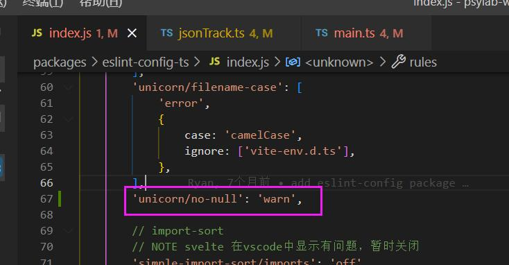
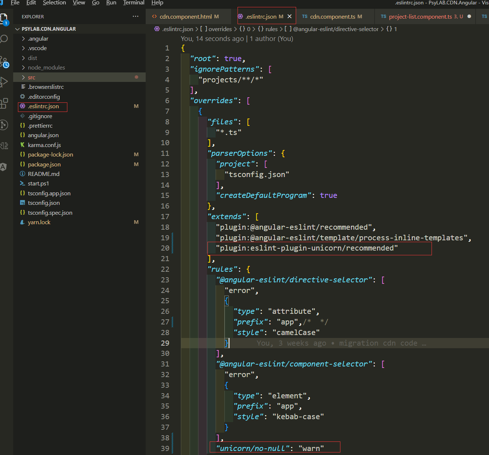

# Null vs Undefined

## 定义

- undefined 类型只有一个值, 即 Undefined，当声明的变量还未被初始化时，变量的默认值为 undefined
- null 类型也只有一个值，即 Null，用来表示尚未存在的对象，常用来表示函数企图返回一个不存在的对象

::: tip
undefined 代表的含义是未定义，一般变量声明了但还没有定义的时候会返回 undefined, null 代表的含义是空对象, 主要用于赋值给一些可能会返回对象的变量，作为初始化。
:::

## 场景使用

### 常见的 undefined 类型

- 变量声明且没有赋值

```ts
let x; // x 为undefined
```

- 获取对象中不存在的属性

```ts
let a = {};
console.log(a.b); // undefined
```

- 函数需要实参，但是调用时没有传值，形参是 undefined

```ts
// 声明函数add时，a，b就是形参。调用函数add(1,2)  1，2就是实参。
function add(a, b) {
  console.log(b);

  return a + b;
}

add(1); // NaN // b输出的结果为undefined
```

- 函数调用没有返回值或者 return 后没有数据，接受函数返回值的变量

```ts
function add(a, b) {
  let c = a + b;
}
let d = add(1, 2); // d的结果为undefined
```

### 常见的 null 类型

- 对象不存在就是 null

```ts
function getVowels(str) {
  const m = str.match(/[aeiou]/gi);
  if (m === null) {
    return 0;
  }
  return m.length;
}
console.log(getVowels("sky")); // expected output: 0
```

```ts
let el = document.getElementById("a"); // el 为 null
```

## null 与 undefined 的不同点

| 序号 |                              null                              |                undefined                 |
| :--: | :------------------------------------------------------------: | :--------------------------------------: |
|  1   |                             空对象                             |                  未定义                  |
|  2   |         赋值, 它可以分配给一个变量, 但是不指向任何对象         |   不赋值, 意味着变量已被声明尚未被赋值   |
|  3   |                    typeof null => "object"                     |     typeof undefined => "undefined"      |
|  4   | null 值是表示 null, empty 或者 non-existent reference 的原始值 |    undefined 是当变量没有被赋值时使用    |
|  5   |                  null === undefined => false                   |       undefined === null => false        |
|  6   |                   null == undefined => true                    |        undefined == null => true         |
|  7   |                     null === null => true                      |     undefined === undefined => true      |
|  8   |               null 转化为 number 时，会转换成 0                | undefined 转换为 number 时，会转换为 NaN |
|  9   |                         1 + null => 1                          |           1 + undefined => NaN           |
|  10  |                    isNaN(1 + null) => false                    |       isNaN(1 + undefined) => true       |
|  11  |                         !null => true                          |            !undefined => true            |

### typeof null 是 object？

typeof null 输出为 'object' 其实是一个底层的错误，但直到现阶段都无法被修复。原因是，在 JavaScript 初始版本中，值以 32 位 存储。前 3 位 表示数据类型的标记，其余位则是值。对于所有的对象，它的前 3 位 都以 000 作为类型标记位。在 JavaScript 早期版本中， null 被认为是一个特殊的值，用来对应 C 中的 空指针 。但 JavaScript 中没有 C 中的指针，所以 null 意味着什么都没有或者 void 并以 全 0(32 个) 表示。因此每当 JavaScript 读取 null 时，它前端的 3 位 将它视为 对象类型 ，这也是为什么 typeof null 返回 'object' 的原因。

### == 和 === 对比会出现 true 和 false ？

很多文章说： undefined 的布尔值是 false ， null 的布尔值也是 false ，所以它们在比较时都转化为了 false ，所以 undefined == null 实际上并不是这样的，ECMA 在 11.9.3 章节中明确告诉我们：

> If x is null and y is undefined, return true.
> If x is undefined and y is null, return true.

这是 JavaScript 底层的内容了，至于更深入的内容，如果有兴趣可以扒一扒 JavaScript 的源码。

### null + 1 和 undefined + 1 表现不同？

这涉及到 JavaScript 中的隐式类型转换，在执行 加法运算 前，隐式类型转换会尝试将表达式中的变量转换为 number 类型。如： '1' + 1 会得到结果 11。

null 转化为 number 时，会转换成 0
undefined 转换为 number 时，会转换为 NaN

从语言学的角度来看：
null 意味着一个明确的没有指向的空值，而 undefined 则意味着一个未知的值。
在某种程度上， 0 意味着数字空值。

## 使用建议

如果程序中涉及到了大量的计算的时候, 在进行 null 在和数字进行运算的时候, null 会转化为 0, 影响计算; 而 undefined 和数字进行运算的时候, 会转成为 NaN, 得出的结果也是 NaN, 不影响计算结果, 这种情况下建议使用 undefined

## 配置 ESLint

在 svelte 中和 angular 中配置 eslint, 让程序推荐使用 undefined 作为默认值, 我们需要安装一下插件

```
npm install eslint-plugin-unicorn
```

- svelte 中配置, 因为 no-null 默认值是 error, 所以无需配置, 也可以手动的重新给 no-null 赋值
  

- angular 中配置, 想要重写插件中的配置项, 直接在下面修改即可
  

## 参考链接

- [深入探究：null 和 undefined 究竟有何区别？](https://juejin.cn/post/7051144396615450655)
