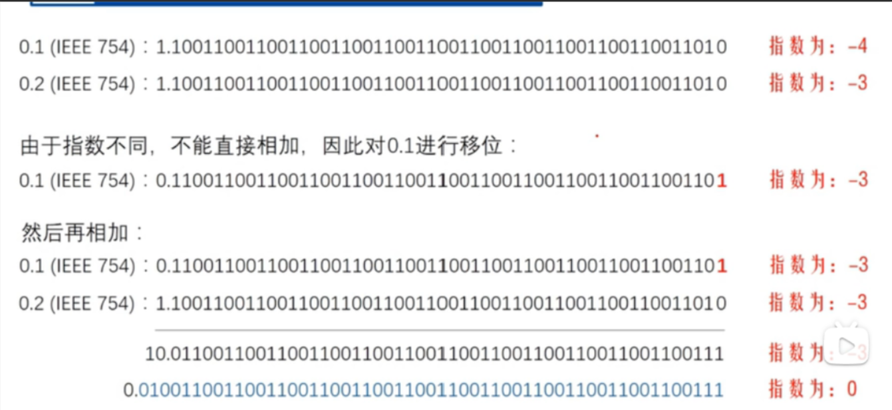

<!-- #### 关于0.1+0.2 不等于0.3 
[参考网址](https://cloud.tencent.com/developer/article/1586532)

> 0.1+0.2=0.30000000000000004     0.7+0.1 = 0.7999999999999999

1)、什么是二进制   
二进制只包括0和1两个数字，也就是逢2进1. 这也就是我们计算机采用的二进制。    与cpu的晶体管的开和关两种状态一一对应 

2)、二进制如何转化十进制
> 整数部分除以2，逆序取余；小数部分乘以2 ；顺序取整；

例如:十进制数105.625转化成二进制数是1101001.101

```
105÷2=52  1(结果看是否有余数)     0.625x2=1.25  1(结果看整数部分)
52÷2=26   0                                   0.25x2=0.5    0
26÷2=13   0			               0.5x2=1	       1
13÷2=6    1                                    因此，小数部分为"101"
6÷2= 3    0
3÷2 =1    1
1÷2=0     1
因此，整数部分为"1101001" 
```

3)、二进制的指数形式
任何一个十进制数D都可以表示成D=M*10E。同理。任何一个二进制数B都可以表示成B=M*2E.其中，E代表指数M为B的尾数
例如 
十进制105可以表示为:1.05*10². 
#### ？为什么会出现这种形式
#### 举例:以5位长度十进制为例，如果不采用科学计数法，5位长度最大可以表示99999；而采用科学计数法(如果前三位存放指数，后2位存放尾数) 则最大可以表示9.99*10999


4）、浮点数IEEE 754标准
IEEE 754是浮点数的运算标准。虽然可以使用指数 但是位数也是有限的。小数确有无线小数的可能。


#### 为什么0.1+0.2 !=0.3
> 将十进制的0.1和0.2转换成二进制

转化规则:整数部分除以2，逆序取余；小数部分乘以2，顺序取整
● 十进制数0.1转成二进制数为:
0.0001100110011001100110011001100110011001100...
● 十进制的0.2转化成二进制数为
0.001100110011001100110011001100110011001100...
将一般二进制转化成指数形式
● 十进制数0.1转化成二进制指数形式(简化)
一般形式：0.0001100110011001100110011001100110011001100...
指数形式:  1.1001100110011001100110011001100110011001100...
IEE754:       1.10011001100110011001100110011001100110010
指数为-4

● 十进制数0.2转化成二进制指数形式(简化)
一般形式:0.001100110011001100110011001100110011001100...
指数形式:1.1001100110011001100110011001100110011001100...
指数为-3 
因为遵循浮点数IEEE 754标准 所以只保留52位小数，53位舍弃时0舍1入
由于指数不同，不能直接相加 需要对0.1进行移位

上面是二进制的截图。如果计算还需要将二进制转化成十进制。二进制转化十进制的方法是按照位权展开求和。


#### 解决办法（浮点数精度问题）
* 使用Number.EPSILON [参考地址](https://developer.mozilla.org/zh-CN/docs/Web/JavaScript/Reference/Global_Objects/Number/EPSILON)
> 属性它表示 1 与大于 1 的最小浮点数之间的差

这个时候我们只要判断(0.1+0.2)-0.3小于Number.EPSILON，在这个误差的范围内就可以判定0.1+0.2===0.3为true。

```ts
function numbersequal(a,b){ 
  return Math.abs(a-b)<Number.EPSILON;
} 
var a=0.1+0.2， b=0.3;
console.log(numbersequal(a,b)); //true
```
 -->
