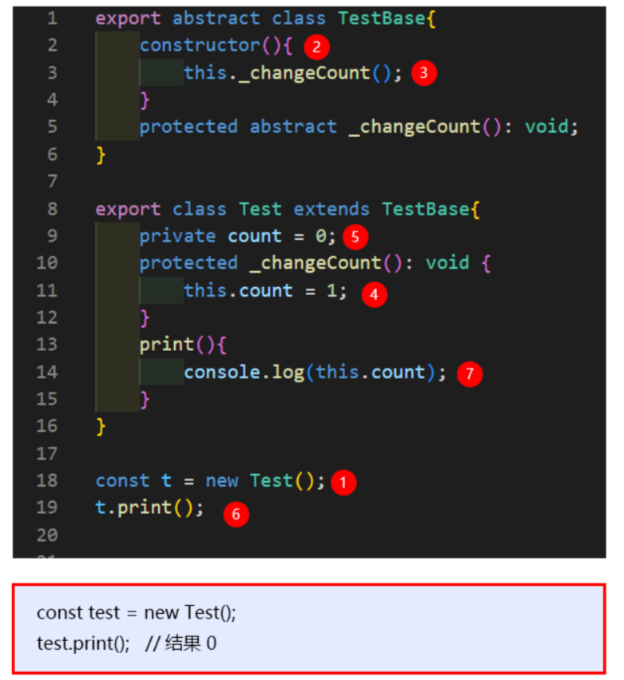
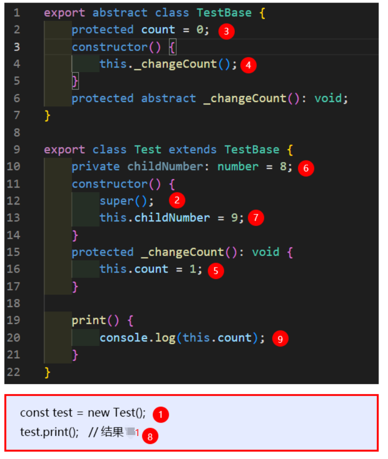

#### 关于javascript中class
[链接参考](https://www.typescriptlang.org/play?#code/FAQwRgzgLgTiDGUAE8A2IISQFQKbQCENcBvYJClAewDtoYBXRKmACgEozLukoALAJYQAdAH14fEDQDmuAMJUGNKBwDc5SgF8NFAA4wqUXIlwATJOHoJk4yTPmLlHAFxIAblQGn124GgxYeNBIuAAeRjSmgfhQRBCkOkj6Am4gRtRKyAC8SAAM6tz6hsZG5rZSsgqZLu6e5lw8FPxCwvCO2UgAjAVaiclOnIncbXRUqLjCqFTSrM0ibZnsPRTaviPBHTS4AO44MWrAUML9KksaQA)

```
abstract class TestBase{
    constructor(){
        this._changeCount();
    }
    protected abstract _changeCount(): void;
}

class Test extends TestBase{
    private count = 0;
    protected _changeCount(): void {
        this.count = 1;
    }
    print(){
        console.log(this.count);
    }
}

const t = new Test();
t.print();
```


#### 两个都有构造器的函数
```
export abstract class TestBase {
    protected count = 0;
    constructor() {
        this._changeCount();
    }
    protected abstract _changeCount(): void;
}

export class Test extends TestBase {
    private childNumber: number = 8;
    constructor() {
        super();
        this.childNumber = 9;
    }
    protected _changeCount(): void {
        this.count = 1;
    }

    print() {
        console.log(this.count);
    }
}

const t = new Test();
t.print();
```


总结  TypeScript class 构造函数和成员的初始化顺序
● 基类的成员初始化
● 基类的构造函数初始化
● 子类的成员初始化
● 子类的构造函数初始化